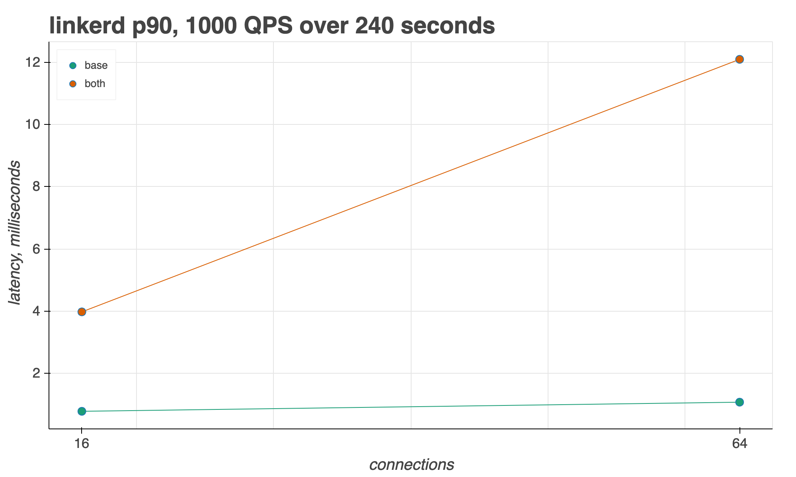
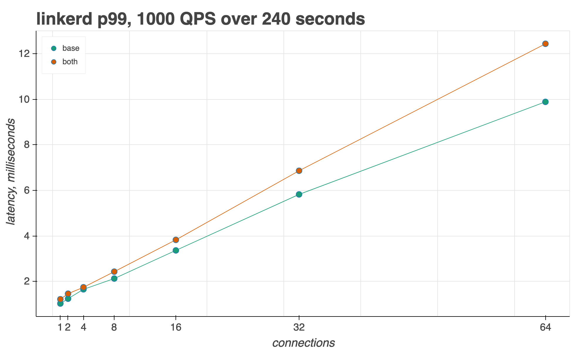

## Linkerd Benchmarking 

In addition to a tuned Istio install, we also provide a Linkerd installation profile to run the same `../runner/` tests on. 

Sources:
- https://linkerd.io/2/getting-started/
- https://linkerd.io/2/reference/proxy-metrics/ 

See the [example-comparison](example-comparison/) directory for how to run the same tests with both Istio and Linkerd.

<<<<<<< HEAD

### Prerequisites 

[the Linkerd CLI tool](https://linkerd.io/2/getting-started/#step-1-install-the-cli)

=======
>>>>>>> upstream/master
### 1 - create cluster 

```bash 
./linkerd/istio-install/create-cluster  
```

### 2 - install Linkerd 

```bash
./linkerd/setup-linkerd.sh <VERSION> 
```

### 3. deploy the fortio test environment 

```bash
NAMESPACE="twopods"
kubectl create namespace $NAMESPACE  
kubectl annotate namespace $NAMESPACE linkerd.io/inject=enabled
DNS_DOMAIN=local LINKERD_INJECT=enabled ./setup_test.sh
<<<<<<< HEAD
kubectl get deploy -n $NAMESPACE -o yaml | linkerd inject - --skip-inbound-ports=8077 --skip-outbound-ports=8077 | kubectl apply -f -

=======
>>>>>>> upstream/master
``` 

### 4. Run benchmark 

Example:

```
<<<<<<< HEAD
python runner/runner.py 16,64 1000 240 --baseline --mesh=linkerd
=======
python runner/runner.py 1,2,4,8,16,32,64 1000 240 --baseline --mesh=linkerd
>>>>>>> upstream/master
```

### 5. Extract Fortio latency metrics to CSV 

**Note** - Linkerd proxy CPU/memory usage not yet implemented, only latency performance.

```
export FORTIO_CLIENT_URL=<fortio svc EXTERNAL_IP:port>

python ./runner/fortio.py $FORTIO_CLIENT_URL
```

### 6. Visualize results 

```
python ./runner/graph.py <PATH_TO_CSV> <METRIC> --mesh=linkerd 
```

#### Example: 

```
<<<<<<< HEAD
python ./runner/graph.py linkerd.csv p90 --mesh=linkerd 
```

Should output: 


=======
python ./runner/graph.py linkerd.csv p99 --mesh=linkerd 
```


>>>>>>> upstream/master
